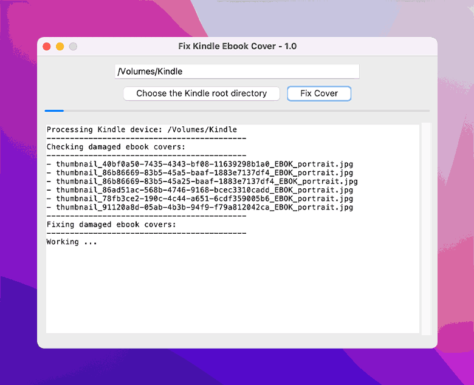
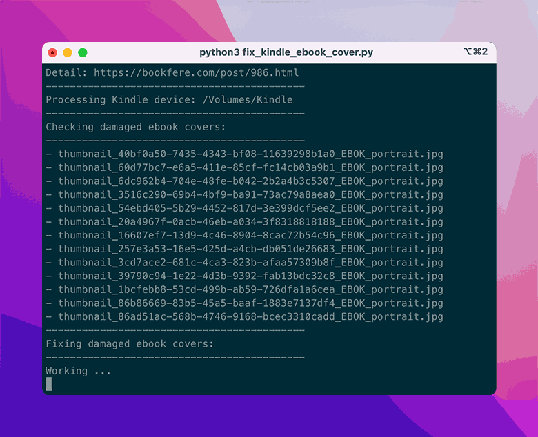

# Fix-Kindle-Ebook-Cover

This is a tool to fix damaged ebook cover in kindle as below.


Detail: [https://bookfere.com/post/986.html](https://bookfere.com/post/986.html)

## Installation

Install [__Python__](https://www.python.org/downloads/) (Required version __>= 3.5__) and clone or download this repository:

```console
$ git clone https://github.com/bookfere/Fix-Kindle-Ebook-Cover.git
```

You can also use the single file package on [__Releases__](https://github.com/bookfere/Fix-Kindle-Ebook-Cover/releases) page if you do not want to install Python.

* macOS 10.15 (Catalina) or newer.
* Windows 10 (x64) or newer.

## Usage

__GUI version:__

Double click __fix_kindle_ebook_cover_gui.pyw__ (if you are using the single file package, open __Fix Kindle Ebook Cover.app__ or __Fix Kindle Ebook Cover.exe__), choose a Kindle root directory, and click "Fix Cover" button.



__CLI version:__

Run the script __fix_kindle_ebook_cover.py__ on terminal or cmd. It will automatically detect Kindle root directories:

```console
$ python3 fix_kindle_ebook_cover.py
```

You can also specify one or more Kindle root directories:

```console
$ python3 fix_kindle_ebook_cover.py /path/to/kindle
$ python3 fix_kindle_ebook_cover.py /path/to/kindle1 /path/to/kindle2
```

To delete orphan ebook covers, you can add an option `-a clean`.



## Technical details

Most of the heavy lifting is done by other people's code, which is included in this repo:

* Base code is from [get-mobi-cover-image](https://github.com/alexwlchan/get-mobi-cover-image) by __Alex Chan__. Used under GPL-3.
* `File.py` is from [KindleButler](https://github.com/AcidWeb/KindleButler) by **Paweł Jastrzębski**. Used under GPL-3.
* `DualMetaFix.py` by **K. Hendricks**. Used under GPL-3.
* `KindleUnpack.py` by **M. Hannum, P. Durrant, K. Hendricks, S. Siebert, fandrieu, DiapDealer, nickredding**. Used under GPL-3.

## License

GPL v3.
